# 🤖 AI Multi-Agent Workflow Platform
### *Intelligent Task Flow Platform with Multi-Agent Collaboration*

<div align="center">

[](https://your-app-name.streamlit.app)
[](https://www.python.org/downloads/)
[](LICENSE)
[](https://github.com/your-username/ai-workflow-platform)

**[🌐 Live Demo](https://your-app-name.streamlit.app)** • **[📖 Documentation](docs/)** • **[🚀 Quick Start](#quick-start)** • **[⚙️ Admin Panel](/Admin)**

</div>

---

## 🎯 Project Vision

Create an **end-to-end intelligent production pipeline**: 
```
Customer → Requirement Clarification → Task Decomposition/Quotation → Multi-Agent Execution → Smart Contract Escrow → Packaged Delivery
```

### 🏗️ Four Core Modules

| Module | Description | Technologies |
|--------|-------------|-------------|
| 🎪 **Entry & Conversation** | UI + LLM Dialogue + Payment | Streamlit, OpenAI, DeepSeek |
| 🧠 **Central Processor** | Task Splitting, Quotation, Scheduling | FastAPI, Python |
| 🤖 **Execution Agents** | Agent A (OCR), Agent B (TTS) | PIL, ElevenLabs |
| 💰 **Delivery & Settlement** | Package Output, Smart Contract | CrossMe, Web3 |

## 📁 Project Structure

<details>
<summary><b>🔍 Click to expand directory structure</b></summary>

```
AI-Workflow-Platform/
├── 📄 streamlit_app.py          # 🌟 Main Streamlit Application
├── 📄 requirements.txt          # Python Dependencies
├── 📁 pages/                    # Multi-page Application
│   └── 1_Admin.py              # ⚙️ Admin Dashboard
├── 📁 .streamlit/              # Streamlit Configuration
│   ├── config.toml             # Theme & Server Settings
│   └── secrets.toml.example    # API Keys Template
├── 📁 .github/workflows/       # CI/CD Pipeline
│   └── deploy.yml              # Auto-deployment to Streamlit Cloud
├── 📄 PROJECT_OVERVIEW.md       # 📋 Detailed Project Overview
├── 📄 DEPLOYMENT.md            # 🚀 Deployment Instructions
└── 📁 legacy/                  # Original Multi-Service Version
    ├── frontend/               # SPA Frontend (HTML/CSS/JS)
    ├── orchestrator/           # FastAPI Backend
    ├── agents/                 # AI Agent Services
    │   ├── agentA_ocr/        # 🖼️ Image-to-Text Agent
    │   ├── agentB_tts/        # 🔊 Text-to-Speech Agent
    │   └── auditor/           # 🔍 Quality Control Agent
    ├── contracts/             # 💰 Smart Contract Integration
    └── tests/                 # 🧪 End-to-End Testing
```

</details>
## 🔄 Core Workflow

```mermaid
   flowchart LR
    A[🎭 Customer UI] -->|💬 Dialogue Clarification| B[🤖 Conversation Agent]
    B -->|📋 Output MRD| C[🧠 Central Processor/Orchestrator]
    C -->|📊 Task Split/Quote| D[💳 Payment Backend + CrossMe Contract]
    D -->|💰 Fund Escrow Confirmation| E[🖼️ Agent A: Image-to-Text]
    E -->|✅ Milestone 1 Release| F[🔊 Agent B: Text-to-Speech]
    F -->|✅ Milestone 2 Release| G[📦 Package Delivery]
    G -->|🎉 Final Confirmation| H[📥 Customer Download]
    
    style A fill:#e1f5fe
    style B fill:#f3e5f5
    style C fill:#e8f5e8
    style D fill:#fff3e0
    style E fill:#fce4ec
    style F fill:#f1f8e9
    style G fill:#e0f2f1
    style H fill:#e3f2fd
```


## 🧩 Module Responsibilities & Interfaces

<table>
<tr>
<th width="25%">🎪 Entry Page</th>
<th width="25%">🧠 Orchestrator</th>
<th width="25%">🤖 AI Agents</th>
<th width="25%">💰 Smart Contract</th>
</tr>
<tr>
<td valign="top">

**UI + Conversation + Payment**
- 📝 Collect customer requirements
- 📁 File upload handling  
- 🤖 LLM dialogue for MRD generation
- 💰 Display quotes & payment
- 📊 Progress timeline visualization

</td>
<td valign="top">

**Central Processing Hub**
- 📋 **Input**: MRD (Requirement Doc)
- 📤 **Output**: Task decomposition
- ⏱️ Time estimation & cost calculation
- 🎯 Milestone management
- 🔄 State machine orchestration
- 🔗 Smart contract SDK integration

</td>
<td valign="top">

**Specialized AI Workers**
- 🖼️ **Agent A**: OCR + Cleaning → Markdown
- 🔊 **Agent B**: TTS → MP3 + VTT timeline
- 📋 **Output**: Results + QC self-report
- 🔍 **Auditor**: Quality control & feedback

</td>
<td valign="top">

**CrossMe Integration**
- 💰 Fund escrow management
- 🎯 Milestone-based releases
- ⚖️ Dispute arbitration & refunds
- 🔔 Webhook callbacks to orchestrator
- 📊 Transaction status updates

</td>
</tr>
</table>

## 📊 Core Data Structures

<details>
<summary><b>🔍 Click to expand data models</b></summary>

### 📋 MRD (Requirement Document)
```json
{
  "objectives": "Project goals and outcomes",
  "inputs": "Required files and data",
  "output_standards": "Quality and format requirements", 
  "acceptance_criteria": "Success metrics",
  "budget": "Cost constraints",
  "deadline": "Timeline requirements"
}
```

### 💰 Quote (Pricing Document)
```json
{
  "tasks": ["Agent A: OCR", "Agent B: TTS"],
  "hours": [2.5, 1.5],
  "rates": [20.0, 15.0], 
  "buffer": 0.2,
  "milestone_ratios": [0.5, 0.3, 0.2]
}
```

### 🎫 Task Ticket (Work Order)
```json
{
  "agent_id": "agent_a_ocr",
  "inputs": "uploaded_image.png",
  "expected_outputs": "cleaned_text.md",
  "status": "pending|processing|completed|failed",
  "qc_report": {"score": 95, "issues": []}
}
```

*📖 Detailed examples available in `docs/state_machine.md`*

</details>

## 🎭 Agent Instructions & Prompts

<details>
<summary><b>🔍 Click to expand prompt templates</b></summary>

| Agent | Responsibility | API Integration |
|-------|---------------|-----------------|
| 💬 **Conversation Agent** | Requirement clarification & JSON output | ✅ Ready |
| 📊 **Decomposition Agent** | Task breakdown, estimation, buffering | ✅ Ready |
| 🖼️ **Agent A (OCR)** | OCR + Markdown + QC reporting | ✅ Ready |
| 🔊 **Agent B (TTS)** | TTS + VTT + QC reporting | ✅ Ready |
| 🔍 **Auditor Agent** | Quality inspection & revision suggestions | 🚧 Planned |

*📖 Complete templates available in `docs/prompt_templates.md`*

</details>

## 🚀 Quick Start

<div align="center">

### 🌟 **Option 1: One-Click Online Experience**
[](https://your-app-name.streamlit.app)

**No installation required! Click above to try it now.**

</div>

### 💻 **Option 2: Local Development**

<details>
<summary><b>🔧 Click to expand local setup instructions</b></summary>

#### **Streamlit Version (Recommended)**
```bash
# 1. Clone the repository
git clone https://github.com/your-username/ai-workflow-platform.git
cd ai-workflow-platform

# 2. Install dependencies  
pip install -r requirements.txt

# 3. Launch the application
streamlit run streamlit_app.py
```

#### **Multi-Service Version (Advanced)**
```bash
# 1. Start Orchestrator
cd orchestrator
uvicorn main:app --reload

# 2. Start Frontend  
cd frontend
npm install && npm run dev

# 3. Configure CrossMe Testnet
# Fill in CrossMe API Key/Endpoint in contracts/escrow.js
node contracts/test_escrow.js

# 4. Start AI Agents
cd agents/agentA_ocr && python run.py
cd agents/agentB_tts && python run.py
```

</details>

## 🛣️ Development Roadmap

| Milestone | Status | Description |
|-----------|--------|-------------|
| **M1** | ✅ **Complete** | MRD/Quote workflow + Frontend display |
| **M2** | 🚧 **In Progress** | CrossMe escrow integration |
| **M3** | ✅ **Complete** | Orchestrator state machine + Agent A/B MVP |
| **M4** | 🚧 **In Progress** | Package delivery + Auto-audit |
| **M5** | 📋 **Planned** | End-to-end testing with sample cases |

---

## ✨ Features & Capabilities

<div align="center">

### 🎯 **Core Features**

</div>

<table>
<tr>
<td width="50%" align="center">

### 🎪 **User Interface**
- 🎨 **Responsive Design**: Desktop & mobile optimized
- 🌙 **Dark/Light Mode**: Automatic theme switching  
- 📱 **Progressive Web App**: Install as native app
- 🎭 **Multi-page Architecture**: Clean navigation
- ⚙️ **Admin Dashboard**: System configuration & analytics

</td>
<td width="50%" align="center">

### 🤖 **AI Capabilities**
- 💬 **Smart Conversation**: Multi-LLM support (GPT, DeepSeek, Qianwen)
- 🖼️ **Image OCR**: Extract text from images with confidence scoring
- 🔊 **Text-to-Speech**: High-quality voice synthesis with ElevenLabs
- 📊 **Auto-Quotation**: Dynamic project pricing generation
- 🔍 **Quality Control**: Automated QC reports and scoring

</td>
</tr>
<tr>
<td align="center">

### 💰 **Business Logic**
- 📋 **Project Management**: End-to-end workflow tracking
- 💳 **Smart Contracts**: CrossMe blockchain escrow integration
- 📈 **Real-time Analytics**: Live project statistics and metrics
- 🎯 **Milestone System**: Automated payment releases
- 📦 **Package Delivery**: Organized result downloads

</td>
<td align="center">

### 🔧 **Technical Stack**
- 🐍 **Python**: Streamlit, FastAPI, Pandas
- 🧠 **AI/ML**: OpenAI, ElevenLabs, PIL, OCR engines
- 🎨 **Frontend**: HTML5, CSS3, JavaScript ES6+
- ⚡ **Performance**: Async processing, caching, optimization
- 🚀 **Deployment**: GitHub Actions, Streamlit Cloud

</td>
</tr>
</table>

### 🔑 **API Integration Support**

<div align="center">

| Service | Status | Description | Configuration |
|---------|--------|-------------|---------------|
| 🤖 **OpenAI GPT** | ✅ Ready | Advanced language models | API Key required |
| 🚀 **DeepSeek** | ✅ Ready | Cost-effective AI reasoning | API Key required |
| 🧠 **Qianwen** | ✅ Ready | Multilingual AI capabilities | API Key required |
| 🔊 **ElevenLabs** | ✅ Ready | Premium voice synthesis | API Key required |
| 🎭 **Local Mock** | ✅ Ready | No-cost testing environment | No setup needed |

</div>

## 🔄 Architecture Comparison

<div align="center">

### **Streamlit vs Multi-Service Architecture**

</div>

<table>
<tr>
<th width="20%">🏗️ **Aspect**</th>
<th width="40%">🏢 **Multi-Service Version**</th>
<th width="40%">⚡ **Streamlit Version**</th>
</tr>
<tr>
<td align="center"><b>🚀 Deployment</b></td>
<td>❌ Requires 3+ separate servers<br>❌ Complex orchestration needed<br>❌ Multiple service management</td>
<td>✅ Single application deployment<br>✅ One-click GitHub integration<br>✅ Automatic cloud hosting</td>
</tr>
<tr>
<td align="center"><b>💻 Development</b></td>
<td>❌ High maintenance overhead<br>❌ Service coordination complexity<br>✅ Full microservice flexibility</td>
<td>✅ Low maintenance overhead<br>✅ Simplified development workflow<br>✅ Rapid prototyping capability</td>
</tr>
<tr>
<td align="center"><b>👥 User Experience</b></td>
<td>❌ Requires local installation<br>❌ Complex setup process<br>✅ Full API integration support</td>
<td>✅ Instant online access<br>✅ Zero installation required<br>✅ Mobile-optimized interface</td>
</tr>
<tr>
<td align="center"><b>📈 Scalability</b></td>
<td>✅ High scalability potential<br>✅ Independent service scaling<br>✅ Enterprise-grade architecture</td>
<td>✅ Medium scalability<br>✅ Streamlit Cloud auto-scaling<br>✅ Suitable for most use cases</td>
</tr>
</table>

---

## 🤝 Contributing

<div align="center">

**We welcome contributions from the community!**

[](https://github.com/your-username/ai-workflow-platform/graphs/contributors)

</div>

### 🛠️ **How to Contribute**

1. **🍴 Fork** the repository
2. **🌿 Create** a feature branch (`git checkout -b feature/AmazingFeature`)
3. **💾 Commit** your changes (`git commit -m 'Add some AmazingFeature'`)
4. **📤 Push** to the branch (`git push origin feature/AmazingFeature`)
5. **🔄 Open** a Pull Request

### 📋 **Contribution Areas**

- 🐛 **Bug Fixes**: Report and fix issues
- ✨ **New Features**: Enhance functionality
- 📚 **Documentation**: Improve guides and examples
- 🧪 **Testing**: Add test cases and scenarios
- 🎨 **UI/UX**: Design improvements and accessibility
- 🔗 **Integrations**: New AI service connections

---

## 📄 License

<div align="center">

This project is licensed under the **MIT License** - see the [LICENSE](LICENSE) file for details.

[](https://opensource.org/licenses/MIT)

</div>

---

## 🙏 Acknowledgments

<div align="center">

**Special thanks to the amazing tools and services that make this project possible:**

[](https://streamlit.io/)
[](https://openai.com/)
[](https://python.org/)
[](https://github.com/)

</div>

---

<div align="center">

### 🌟 **Star this project if you find it helpful!**

[](https://github.com/your-username/ai-workflow-platform)
[](https://github.com/your-username/ai-workflow-platform)
[](https://github.com/your-username/ai-workflow-platform)

**Made with ❤️ by the AI Workflow Platform Team**

</div>

